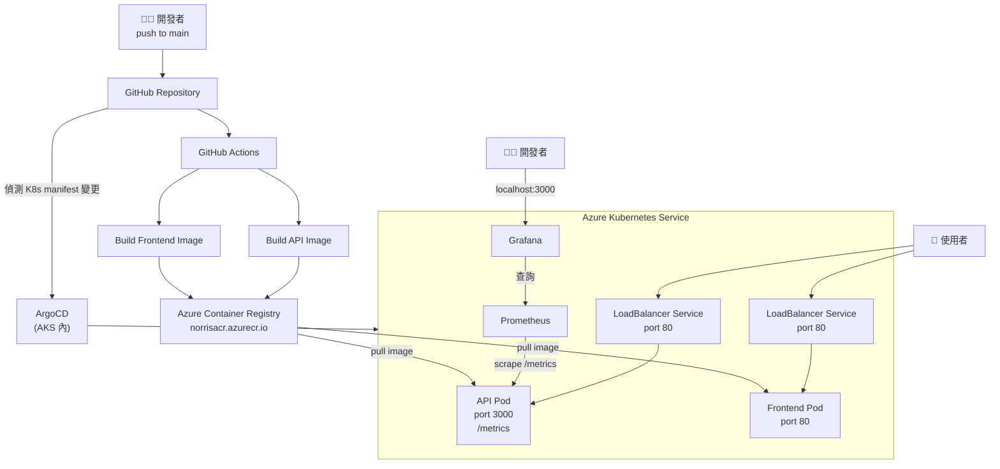

## 建構完整 CI/CD + GitOps 自動化部署流水線於 Azure Kubernetes Service (AKS)

### 專案亮點

1. CI/CD Pipeline（GitHub Actions）：Push 到 main 分支時自動觸發，平行建置 API 與 Frontend 兩個 Docker Image，並推送至 Azure Container Registry (ACR)，完成後自動更新 K8s Manifest 中的 image tag（以 commit SHA 作為版本標識）

2. GitOps 部署（ArgoCD）：以 ArgoCD 監控 GitHub repo 中的 K8s Manifest，偵測到 Manifest 變更後自動同步至 AKS，實現 selfHeal + prune，確保叢集狀態與 repo 一致

3. 可觀測性（Prometheus + Grafana）：在 Node.js API 中埋入自訂 Prometheus metrics（http_requests_total），透過 ServiceMonitor 讓 Prometheus Operator 自動抓取，並在 Grafana 視覺化監控 API 流量與錯誤率

4. 多架構相容：解決本機 Apple Silicon（arm64）與 AKS 節點（amd64）架構不符問題，使用 docker buildx 強制 cross-platform build

## 專案架構流程圖

### 流程說明

本地開發 → push to GitHub
→ GitHub Actions build image → push 到 ACR
→ ArgoCD 偵測 manifest 變更 → sync 到 AKS
→ AKS 從 ACR pull 新 image，更新 pod
→ Prometheus 持續 scrape → Grafana 顯示

