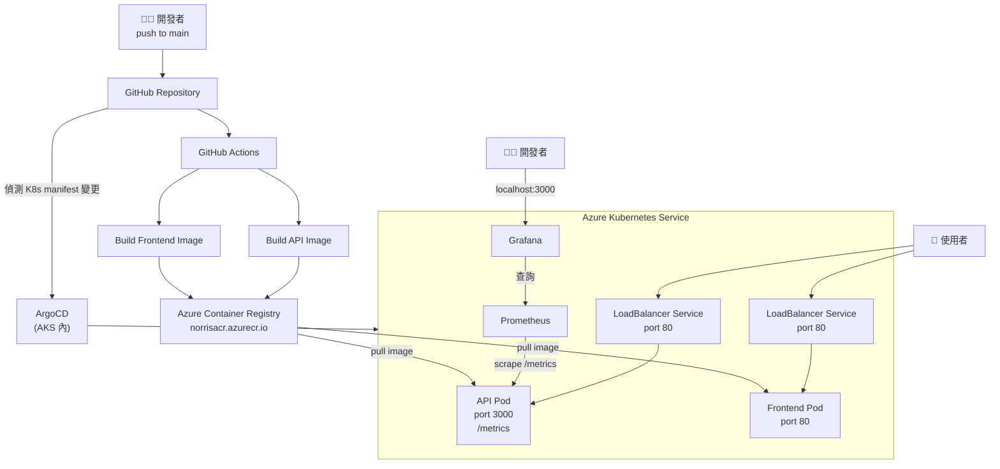

# Debug Log

## 2026-03-09 — 自動部署流程卡關排查

### 在做什麼
希望程式碼推上 GitHub 後，網站能自動更新，不用手動去戳伺服器。

整個流程應該是：
推程式碼 → GitHub 自動打包新版 → 丟到 Azure 倉庫 → 網站自動換新版

---

### 遇到的三個問題

**問題一：名字打錯**

image 的名字在兩個地方寫不一樣，一邊叫 `recommend-server`，一邊叫 `api`，
Kubernetes 找不到東西，自然什麼都沒更新。

解法：把兩邊的名字統一。

---

**問題二：兩套更新方式互相打架**

workflow 裡同時寫了「手動叫 Kubernetes 換版本」和「讓 ArgoCD 自動偵測更新」，
兩件事方向不同，互相干擾。

解法（第一輪）：先砍掉手動那段，讓 ArgoCD 自己來。

---

**問題三：ArgoCD 看不到新版，懶得動**

ArgoCD 是靠比對版本號來決定要不要更新，
但因為 image 的版本號一直叫 `latest` 沒有換，
ArgoCD 看了看：「名字一樣，沒有新版嘛。」然後就不動了。

解法（第二輪）：放棄靠 ArgoCD 自動偵測，改成每次推完 image 就直接叫 Kubernetes「重啟一下」，強迫它去抓最新的版本。

---

### 學到什麼

用 `latest` 這個 tag 做自動部署是個常見坑——工具以為你沒換版本就不會動。
最乾脆的解法就是推完直接 rollout restart，不靠工具自己判斷。

---

## 2026-03-09 — CI/CD 優化 + Grafana 監控導入

### 新增的功能

**1. image tag 改用 commit SHA**

原本每次都蓋掉 `latest`，沒有版本記錄。
改成用每次 commit 的 SHA 當 tag，每個版本都有獨立記錄，出問題可以直接回滾到指定版本。

```bash
# 回滾範例
kubectl set image deployment/api api=<ACR>.azurecr.io/api:<舊的sha>
```

**2. API 和 Frontend 改為平行 build**

原本兩個 build 一個等一個，改成同時跑，整體 build 時間縮短約一半。

**3. 加上 rollout status 確認部署結果**

deploy 完不再默默結束，改成等 pod 真的跑起來才算成功，失敗會明確報錯。

**4. 導入 Prometheus + Grafana 監控**

- API 加了 `/metrics` 路由（使用 `prom-client`），讓 Prometheus 可以定期來抓資料
- `deployment.yaml` 加了 annotation，告訴 Prometheus 要抓哪個 port 和路徑
- AKS 上用 Helm 裝了 `kube-prometheus-stack`，一次包含：
  - Prometheus（收集指標）
  - Grafana（畫圖）
  - Node Exporter（機器層級指標）
  - kube-state-metrics（K8s pod/node 狀態）

現在可以在 Grafana 看到 API 的請求數、回應時間、記憶體用量，以及整個 K8s cluster 的健康狀況。

---

## 2026-03-10 — 專案架構流程圖



### 流程說明

本地開發 → push to GitHub
→ GitHub Actions build image → push 到 ACR
→ ArgoCD 偵測 manifest 變更 → sync 到 AKS
→ AKS 從 ACR pull 新 image，更新 pod
→ Prometheus 持續 scrape → Grafana 顯示
